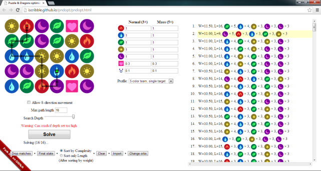

pndopt --- Puzzle & Dragons Optimizer
=====================================

This project is a Fork of [the original version written by kennytm](https://github.com/kennytm/pndopt). 

The purpose of this fork is to refator the scripting so that OOP objects such as Orb, Board and Solution are utilized in the code. It is my belief that doing so will allow easier puzzle-solving optimization in the future.

`pndopt` is a Javascript application to find an optimal path leading to a high-combo move in Puzzle & Dragons.

I recommend only using it in an emergency, however it can be a helpful training tool as well!

Usage
-----

1. Left or right click on an orb to select its type.
2. Click "Solve" after completing the board.
3. Choose one solution and see how it is performed.

Requirements
------------

* Firefox (version 19 or above).
* Screen resolution of 1280×800 or above.

TODO
----

* Introduce better solver (e.g. [this post](http://puzzleanddragonsforum.com/showthread.php?tid=1603&pid=6263#pid6263)). Currently it is just a brute-force greedy algorithm, which may not produce truly optimal result.
* Resolve overlapping lines and points.
* Simulate swapping and matching when playing the animation.
* The default weight of the profiles may need to be adjusted.
